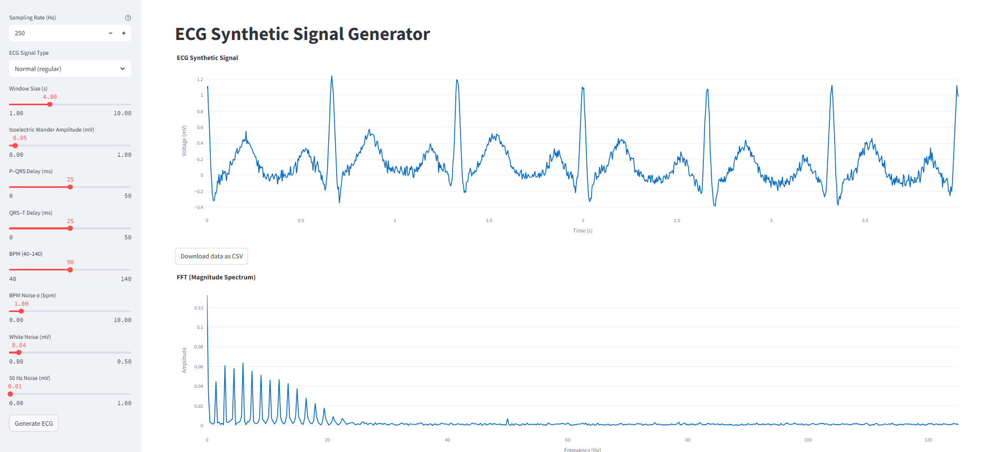

# EKG_signal_GEN-GUI
Aplicación web interactiva para generar y analizar señales ECG sintéticas, diseñada con Streamlit, NeuroKit2 y Plotly. Permite ajustar en tiempo real parámetros clave de la señal y obtener representaciones en dominio tiempo-frecuencia.



**Características principales**  
- **Panel lateral** con logo, secciones **ABOUT** y **CREDITS**, y controles para:
  - Frecuencia de muestreo (Sampling Rate)  
  - Duración del registro (Window Size)  
  - Amplitud de baseline wander (Isoelectric Wander)  
  - Latencias P–QRS y QRS–T  
  - Ritmo cardíaco (BPM) y ruido en el BPM  
  - Ruido blanco y ruido de red (50 Hz)  
- **Generación de señal ECG** usando NeuroKit2 (`ecg_simulate`) y adición de:
  - Baseline wander senoidal  
  - Ruido blanco y de 50 Hz  
- **Visualizaciones** en la zona principal:
  1. Señal ECG en tiempo  
  2. Espectro de magnitud por FFT  
  3. STFT (Short-Time Fourier Transform)  
  4. CWT (Continuous Wavelet Transform, Morlet)  
- **Descarga**: un único botón que empaqueta en un ZIP:
  - CSV con los datos de tiempo y voltaje  
  - PNG de cada gráfica (ECG, FFT, STFT, CWT)  

**Cómo usar**  
1. Clona el repositorio y coloca tu `logo.png` junto a `app.py`.  
2. Instala dependencias:
   ```bash
   pip install streamlit neurokit2 scipy PyWavelets plotly
3. Ejecuta la app:
  ```bash
   streamlit run app.py
